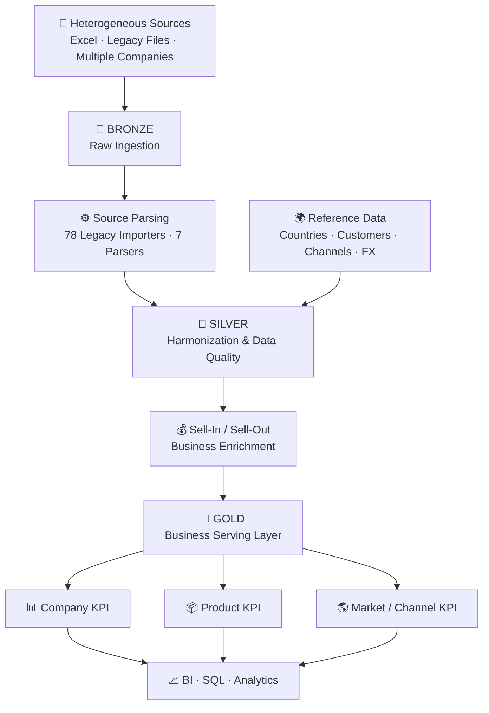
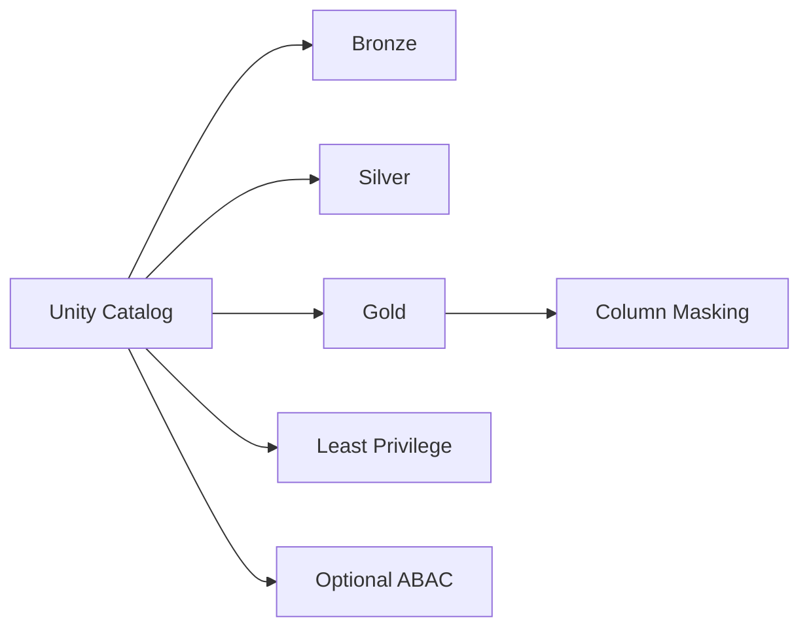

# 🚀 Sell-Out Analytics Pipeline on Azure Databricks


> End-to-end Sell-Out data pipeline built with **Azure Databricks,
> PySpark, Delta Lake and Unity Catalog**, covering heterogeneous
> ingestion, harmonization, data quality, FX processing,
> Sell-In/Sell-Out enrichment and business-ready Gold analytics.

------------------------------------------------------------------------

## 🖼️ Project at a Glance

The image below is an **illustrative portfolio mockup** of the
architecture and Databricks experience represented by this repository.
It is not a screenshot of a production customer environment.


------------------------------------------------------------------------

## 📌 Overview

This repository is a **sanitized portfolio reconstruction of a
real-world Data Engineering project**.

The pipeline integrates many heterogeneous legacy sources and transforms
them into a governed, harmonized and analytics-ready Lakehouse model.

The public version preserves the engineering complexity of the original
implementation while replacing confidential names, paths, mappings and
business data with safe aliases or synthetic examples.

### What this project demonstrates

-   **78 legacy importers** for heterogeneous historical sources
-   **7 source-specific parsers**
-   PySpark transformation pipelines
-   Delta Lake processing
-   Medallion Architecture
-   Data Quality validation
-   Reference-data management
-   Country / channel / customer mappings
-   FX normalization
-   Sell-In and Sell-Out enrichment
-   Submission version management
-   Business-oriented Gold datasets
-   Unity Catalog governance and masking
-   Databricks Asset Bundles

------------------------------------------------------------------------

## 🏗️ Architecture



  -----------------------------------------------------------------------
  Layer                               Responsibility
  ----------------------------------- -----------------------------------
  🥉 **Bronze**                       Source-aligned ingestion and
                                      technical metadata

  🥈 **Silver**                       Parsing, standardization, mappings,
                                      FX, validation and harmonization

  🥇 **Gold**                         Reporting-specific business rules,
                                      latest-submission selection and
                                      analytical KPIs
  -----------------------------------------------------------------------

------------------------------------------------------------------------

## 🧰 Technologies

  Technology                     Usage
  ------------------------------ ---------------------------------------------
  **Azure Databricks**           Lakehouse processing and orchestration
  **PySpark**                    Distributed transformations
  **Spark SQL**                  Analytical transformations and Gold outputs
  **Delta Lake**                 Reliable managed tables
  **Unity Catalog**              Governance, access control and masking
  **Auto Loader**                Incremental file ingestion pattern
  **Databricks Asset Bundles**   Deployment-oriented job definition
  **Python**                     Parsing, validation and utilities
  **Git / GitHub**               Version control and portfolio delivery

------------------------------------------------------------------------

## 🔄 Silver Layer

Silver is the reusable quality and harmonization layer.

``` text
Reference countries / currencies
          ↓
Customer & channel mappings
          ↓
Product / company reference data
          ↓
FX normalization
          ↓
03_harmonize
          ↓
04_valorize_sellin
          ↓
05_valorize_sellout
```

Main responsibilities include schema normalization, country
normalization, customer/channel resolution, mapping-status tracking, FX
normalization, null/completeness checks, source traceability and
Sell-In/Sell-Out business enrichment.

------------------------------------------------------------------------

## 🥇 Gold Layer

Gold is modeled as a **business serving layer** rather than introducing
fact and dimension tables only for architectural appearance.

### `gold.sellout_curated`

The detailed, trusted Sell-Out dataset for analytical consumption.

A mocked but realistic reporting rule handles source resubmissions:

``` text
company + reporting_month
             ↓
     highest submission_id
             ↓
   publish latest version
```

Older submissions are excluded from reporting to prevent double
counting.

### Business datasets

  -----------------------------------------------------------------------
  Dataset                             Purpose
  ----------------------------------- -----------------------------------
  `gold.sellout_curated`              Detailed business-ready Sell-Out
                                      data

  `gold.sellout_company_kpi`          Monthly company performance and MoM
                                      trend

  `gold.sellout_product_kpi`          Semester product performance and
                                      market reach

  `gold.sellout_market_kpi`           Monthly country/channel performance
  -----------------------------------------------------------------------

Example KPIs include total sales, quantity, active products, active
markets, active customers, average sales per unit and month-over-month
sales growth.

------------------------------------------------------------------------

## 🛡️ Data Quality

Data Quality is applied across the pipeline rather than only at the
reporting boundary.

**Silver:** mandatory fields, mapping completeness, invalid/null values,
non-negative measures and reference consistency.

**Gold:** mandatory business identifiers, non-negative sales/quantities,
row identity uniqueness, one selected submission per reporting period
and aggregate availability.

------------------------------------------------------------------------

## 🔐 Governance

The project demonstrates **Unity Catalog** as the governance boundary:

-   Bronze / Silver / Gold schema separation
-   group-oriented least privilege
-   Unity Catalog managed tables
-   customer-column masking
-   Delta `NOT NULL` and `CHECK` constraints
-   optional governed-tag / ABAC strategy
-   clear separation between repository sanitization and runtime access
    control



------------------------------------------------------------------------

## 📁 Repository Structure

``` text
sellout_databricks_pyspark/
│
├── src/
│   ├── bronze/
│   ├── silver/
│   ├── gold/
│   ├── governance/
│   └── common/
│
├── resources/
├── docs/
│   └── images/
├── tests/
├── sample_data/
├── databricks.yml
├── SANITIZATION_REPORT.md
└── README.md
```

------------------------------------------------------------------------

## 🔒 Portfolio & Data Privacy

This is **not a production data dump**.

The public repository intentionally excludes original Git history,
customer/company identities, production records, credentials, secrets,
real storage paths, environment identifiers, proprietary mappings and
identifiable sample values.

Organizations and records used for demonstration are synthetic or
pseudonymized.

The visual shown at the top is also a generated **illustrative mockup**,
not a captured customer or production UI.

------------------------------------------------------------------------

## 🎯 Engineering Decisions

**Silver remains reusable.** Business-specific reporting logic is kept
out of the harmonized layer where possible.

**Gold is business-oriented.** A star schema is not introduced unless
the analytical use case requires one.

**Latest submissions win.** Reprocessed reporting periods are resolved
before analytical publication.

**Data Quality is explicit.** Invalid data is detected before reaching
business reporting.

**Governance is separate from anonymization.** Production information is
removed before GitHub publication; runtime masking is a separate
defense-in-depth control.

------------------------------------------------------------------------

## 🚀 Execution Flow

``` text
1. Configure Unity Catalog catalog / schemas
2. Run ingestion
3. Execute source parsers
4. Prepare reference data
5. Build Silver harmonized data
6. Apply Sell-In / Sell-Out enrichment
7. Build Gold curated dataset
8. Build Gold KPI tables
9. Execute Gold Data Quality checks
```

The repository also contains a Databricks Asset Bundle definition in
`databricks.yml`.

------------------------------------------------------------------------

## 👤 Author

**Antonio Fiumanó**\
Data Engineer \| Databricks \| PySpark \| Azure \| Data Quality

GitHub: [TonyFiuma](https://github.com/TonyFiuma)

------------------------------------------------------------------------

⭐ If you found this project interesting, feel free to explore the
repository and its architecture.
